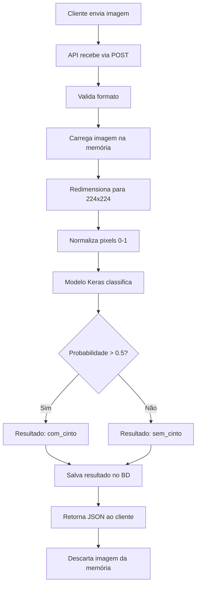

# 🚀 Guia de Instalação e Configuração

## Passo a Passo para Rodar a API

### 1️⃣ Instalar Dependências

Abra o PowerShell na pasta do projeto e execute:

```powershell
pip install -r requirements.txt
```

**Nota:** A instalação do TensorFlow pode demorar alguns minutos.

### 2️⃣ Criar Migrações do Banco de Dados

```powershell
python manage.py makemigrations
```

Você deve ver algo como:
```
Migrations for 'processador':
  processador\migrations\0002_xxxx.py
    - Remove field imagem from imagemupload
    - Add field probabilidade to imagemupload
```

### 3️⃣ Aplicar Migrações

```powershell
python manage.py migrate
```

### 4️⃣ Verificar se o Modelo Existe

Certifique-se que o arquivo do modelo está no lugar correto:

```powershell
Test-Path .\modelos\modelo_cinto_otimizado.keras
```

Se retornar `True`, está tudo certo! ✅

### 5️⃣ Iniciar o Servidor

```powershell
python manage.py runserver
```

Você deve ver:
```
System check identified no issues (0 silenced).
October 17, 2025 - 14:30:00
Django version 5.2.7, using settings 'cintomante_api.settings'
Starting development server at http://127.0.0.1:8000/
Quit the server with CTRL-BREAK.

✓ Modelo carregado com sucesso de: modelos/modelo_cinto_otimizado.keras
```

---

## 🧪 Testando a API

### Opção 1: Interface Web (Mais Fácil)

1. Com o servidor rodando, abra o arquivo `test_frontend.html` no seu navegador
2. Arraste uma imagem ou clique para selecionar
3. Clique em "Analisar Imagem"
4. Veja o resultado!

### Opção 2: Script Python

```powershell
python test_api.py caminho\para\sua\imagem.jpg
```

### Opção 3: cURL (Terminal)

```powershell
curl -X POST http://localhost:8000/processador/ `
  -F "imagem=@caminho\para\imagem.jpg" `
  -H "Accept: application/json"
```

### Opção 4: Postman

1. Crie uma requisição POST para `http://localhost:8000/processador/`
2. Em "Body", selecione "form-data"
3. Adicione um campo chamado `imagem` do tipo "File"
4. Selecione uma imagem
5. Envie!

---

## 📋 Checklist de Verificação

Antes de testar, certifique-se:

- ✅ Python 3.8+ instalado
- ✅ Todas as dependências instaladas (`pip install -r requirements.txt`)
- ✅ Migrações aplicadas (`python manage.py migrate`)
- ✅ Modelo na pasta `modelos/modelo_cinto_otimizado.keras`
- ✅ Servidor rodando (`python manage.py runserver`)
- ✅ Mensagem "✓ Modelo carregado com sucesso" no console

---

## ⚙️ Configurações Importantes

### Ajustar Tamanho de Entrada do Modelo

Se seu modelo usa um tamanho diferente de 224x224, edite `processador/views.py`:

```python
# Linha ~38
img = img.resize((224, 224))  # Mude para o tamanho do seu modelo
```

### Ajustar Threshold de Classificação

Para mudar o limite de 0.5, edite `processador/views.py`:

```python
# Linha ~68
if probabilidade > 0.5:  # Mude o threshold aqui
    resultado = "com_cinto"
else:
    resultado = "sem_cinto"
```

### Permitir Mais Origens (CORS)

Edite `cintomante_api/settings.py`:

```python
CORS_ALLOWED_ORIGINS = [
    "http://127.0.0.1:5500",
    "http://localhost:3000",
    "null",
    # Adicione suas origens aqui
]
```

### Limitar Tamanho do Upload

Adicione em `cintomante_api/settings.py`:

```python
# Limite de 10MB
DATA_UPLOAD_MAX_MEMORY_SIZE = 10485760
```

---

## 🐛 Solucionando Problemas Comuns

### Erro: "No module named 'tensorflow'"

**Solução:**
```powershell
pip install tensorflow==2.18.0
```

### Erro: "Unable to open file"

**Problema:** Modelo não encontrado

**Solução:**
1. Verifique se o arquivo existe:
   ```powershell
   Test-Path .\modelos\modelo_cinto_otimizado.keras
   ```
2. Se não existir, coloque o modelo na pasta `modelos/`

### Erro: "CSRF verification failed"

**Solução:** Para APIs, desabilite CSRF em `settings.py`:

```python
REST_FRAMEWORK = {
    'DEFAULT_AUTHENTICATION_CLASSES': [],
    'DEFAULT_PERMISSION_CLASSES': [],
}
```

### Erro: "Connection refused"

**Problema:** Servidor não está rodando

**Solução:**
```powershell
python manage.py runserver
```

### Erro: "Image file is truncated"

**Problema:** Imagem corrompida

**Solução:** Use uma imagem válida e não corrompida

### Servidor muito lento na primeira requisição

**Normal!** O TensorFlow compila o modelo na primeira execução. As próximas serão mais rápidas.

---

## 📊 Entendendo os Resultados

### Resposta de Sucesso

```json
{
    "id": 1,
    "resultado": "com_cinto",
    "probabilidade": 0.8745,
    "mensagem": "Classificação: COM cinto",
    "enviado_em": "2025-10-17T14:30:00Z"
}
```

**Interpretação:**
- **probabilidade > 0.5** = COM cinto ✅
- **probabilidade ≤ 0.5** = SEM cinto ❌
- Quanto mais próximo de 1.0, mais confiante o modelo está

### Exemplos de Probabilidades

- `0.95` → 95% confiante que está COM cinto
- `0.75` → 75% confiante que está COM cinto
- `0.51` → 51% confiante que está COM cinto (baixa confiança)
- `0.49` → 51% confiante que está SEM cinto (baixa confiança)
- `0.25` → 75% confiante que está SEM cinto
- `0.05` → 95% confiante que está SEM cinto

---

## 🔄 Workflow Completo



---

## 📝 Logs do Servidor

Durante a execução, você verá logs úteis:

```
✓ Modelo carregado com sucesso de: modelos/modelo_cinto_otimizado.keras
[17/Oct/2025 14:30:15] "POST /processador/ HTTP/1.1" 201 150
Classificação: Pessoa está COM cinto de segurança (probabilidade: 0.8745)
```

---

## 🔒 Segurança em Produção

⚠️ **IMPORTANTE:** Antes de colocar em produção:

1. **Mude a SECRET_KEY** em `settings.py`
2. **Configure DEBUG = False**
3. **Configure ALLOWED_HOSTS**
4. **Use HTTPS**
5. **Configure um servidor web (Nginx + Gunicorn)**
6. **Limite o tamanho dos uploads**
7. **Implemente rate limiting**
8. **Use autenticação se necessário**

---

## 📚 Próximos Passos

- [ ] Adicionar autenticação JWT
- [ ] Implementar rate limiting
- [ ] Adicionar logging estruturado
- [ ] Criar endpoint para histórico
- [ ] Adicionar métricas do modelo
- [ ] Implementar cache de predições
- [ ] Dockerizar a aplicação

---

## 💡 Dicas de Performance

1. **GPU:** Se disponível, TensorFlow usará automaticamente
2. **Batch Processing:** Para múltiplas imagens, processe em lote
3. **Model Caching:** O modelo é carregado apenas uma vez
4. **Imagem Otimizada:** Redimensione no cliente antes de enviar

---

## 🆘 Precisa de Ajuda?

- Verifique os logs do servidor
- Teste com uma imagem diferente
- Valide se o modelo está correto
- Confira a documentação do Django REST Framework
- Revise este guia do início

---

✅ **Pronto! Sua API está configurada e funcionando!**
